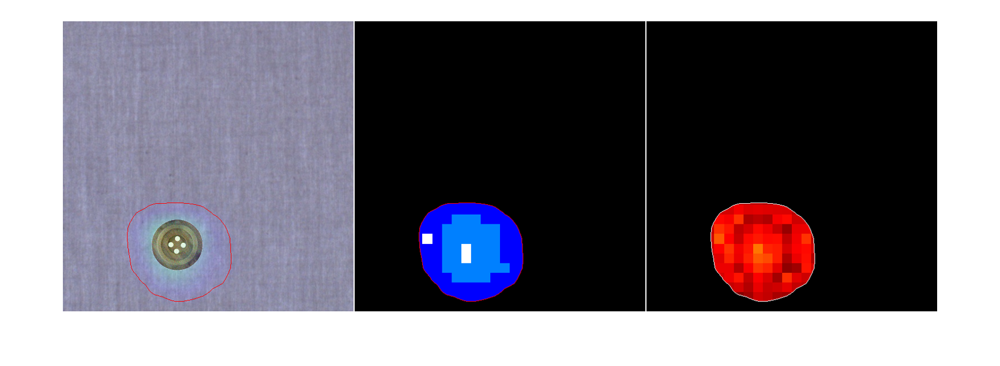

# Oneshot anomaly classification and localization

## Abstract
Anomaly detection is a crucial factor in quality assurance in industry. Especially in the vision inspection domain we have access to many AI solutions.
These are quite powerful and flexible, but they still need specific conditions to be verified in order to perform well, and these conditions often fall short when it comes to address many real applications as we will discuss in this article.
After analyzing the issues we will draft a guideline for the optimal solution and build it. Let's call it the <i>Solution</i>.

### Background
- Most of the widely available solutions for anomaly detection or image classification are focused on standard problems and datasets (to beat the benchmark).
- This implies that they rely on big well classified and clean datasets.
- They are also built to approach the sample as an "unicum" entity, thus working only on the full image.

### Issues
- Most industries, at the production floor level, simply cannot produce such big and well built datasets. They don't have the understanding of the technology, they don't have the knowledge on how to produce such data, they don't have the data ready, they struggle to build the data collection infrastructure, they don't have the time necessary to collect the data needed. And whether they have the data, this may be worthless since it's biased, incomplete o incoherent.
- Industry doesn't care reaching 95-ish% accuracy on ImageNet or COCO, they want to be extremely accurate on their specific use case, with strict needs on precision and recall.
- Industry use cases have to deal with uncertainty. They aren't always pre-determined, and all the scenarios or the possible anomalies may not have been documented. The production may change, and new anomalies may rise.
- Industry struggles to produce big amount of well labeled data. Forget thousands of samples clearly classified, or maybe with pixel-precise ground truths.
- Some sample types are difficult (or nearly impossible, or costly) to produce, the <i>Solution</i> should be able to detect them even without having ever seen them and to learn a new class after seeing that type just once.
- Most important, the <i>Solution</i> must keep on with the production. Once deployed if something new appears you cannot stop the production for let's say "just few days" to go back to the lab to make the system learn the new scenario. The <i>Solution</i> must have all what it needs to deal novelties already provided.
- Last thing, you don't have Phd's working on the line. The effort must be minimal and the operational flow should be intuitive, linear and quick.

## Solution
- The foundation is a quite standard anomaly detection (AD) block. It can be trained with just good unlabeled samples simply picked up from the production line. Normally we suppose that the production line outputs mostly good samples, and the AD can withstand some amount of noise. It's good to deal with even complicate stable patterns. It will serve as region proposal for further checks. It's also useful because while outputting the anomaly map used for the anomaly localization it also produces useful bi-products for the downstream anomaly classification (AC), this means that we will re-use calculations reducing the inference time.
- We then analyze each proposed region, at both micro and macro level (plus intermediate levels) to catch every possible feature that can help us identify the proposed anomaly. This will also help us to classify the area with fine granularity, i.e. segmenting the objects inside the region.
- If the object is different from any previous knowledge (if any) it's (un-)classified as general anomaly, now further effort is required.
- If for any reason the operator wants to classify the anomaly (to better understand the upstream process, for business intelligence or else) or better, if the object that triggered the anomaly is a novelty (respect to the previous knowledge) but not an anomaly, he simply has to point it out on the image. The <i>Solution</i> will collect all the feature information that characterize the object for classification and comparison in the future.
- Here is the important bit. The <i>Solution</i> is able to locally classify the image, understanding if it has ever seen a given object (i.e. with no prior knowledge, aka zero-shot concept) or classify it even if it has previously seen just one or few examples (aka one-shot or few-shots concept). Plus the classification is at pixel level (like a segmentation). Furthermore the classification training is extremely fast and efficient, the consequent downtime is minimal.
- The production flow can go on, the anomalies can be detected as such or classified if the operator needs it. Moreover, if the operator feels that the classification is incorrect, imperfect or needs to be more robust, he can always increase the <i>Solution</i> knowledge with the same point and trace method as above.

### Why it's cool
The <i>Solution</i> introduces an innovative merge of AI concepts to push forward the boundaries of anomaly detection in industrial environments.
- It efficiently implements anomaly detection, only good samples are needed and with a certain amount of robustness to noise. I.e. only good samples randomly picked up from the production line are needed, meaning minimal data collection effort and no labeling costs.
- A strong classification is done using siamese neural networks to analize the artifacts even with no prior knowledge of the artifacts themselves. Take into account that the classification is not necessarily needed, but it comes in hand if we want to discriminate good vs bad artifacts, or classify the artifacts.
- Artifacts on the image are also locally analyzed and classified. This produces a sort of segmentation map indicating the position and extension of each one.
- The classifier is able to work with undefined artifact sizes.
- If a novel artifact is seen it’s correctly detected with an undefined class.
- The classifier can be trained with just that first artifact that is encountered. This simplifies a lot the deployment of the <i>Solution</i>, since it keeps valid the easy-data collection and no-labeling principles.

### What’s next
The solution will be developed in 4 deliverable steps.
1. Anomaly detection and classification localization working at a micro scale. For the anomalous patches local features are extracted and analyzed independently, this will provide the local classification at an almost pixel scale. It works but doesn’t fully exploit the DL advantages on recognizing whole objects (i.e. analyzing the object at a macro scale), this means that the classification is less robust and requires a little more examples than one. Nevertheless it works well and satisfies all the requirements explained above, so we can call it a deliverable.
2. Like the previous, but for the anomalous patches we will extract features at different scales. These will still be analyzed independently, but we can check the coherence of different scale features for the same spot on the image. Thus we should obtain a more robust classification with a finer segmentation.
3. We change paradigm for the classification algorithm in order to analyze the extracted features as a whole, i.e taking into account the spatial dependence between nearby features. This is done via siamese networks, adopting specific measures to deal with undefined object sizes. The resulting object classification will be  more robust and unambiguous, and particularly efficient working in zero-shot or one/few-shot scenarios.
4. We will cover the last mile, update the <i>Solution</i> to the cutting edge of technology, implementing concepts like Instance Segmentation, automatic class proposal and so on.

## Walkthrough

### Use case
The use case is an Anomaly Detection problem for textile fabrics. The cloth is evenly illuminated and acquired using a color matrix camera (image size 512x512x3). The weft is visible along with possible defects (contaminations, flecks, strings, lines and so on). The dataset used is publicly available (see acknowledgements). Besides that we wanted to simulate the presence of some non-anomalous objects to challenge the <i>Solution</i>, thus some good samples are picked and combined with synthetic artifacts to create the new class: clothing buttons.
The ratio is to simulate the following scenario:
- the user starts with only good samples, he hasn’t collected yet examples of the possible artifacts (both anomalous or non-anomalous) that he could encounter during runtime
- the anomaly detection is trained using only good samples un-supervisely picked from the production line
- the <i>Solution</i> is now able to detect new anomalies. Here ends the classic Anomaly Detection
- **first issue**. A new product enters the production line, this has new artifacts (the buttons) never seen in the training phase. Of course the <i>Solution</i> detects it as an anomaly, but the user doesn’t want it.
Here’s the catch, with classic Anomaly Detection the user should stop the production or disable the system, acquire enough new images of the new artifact (hoping he has the knowhow to understand how and how many) and retrain the system crossing his fingers and test it. If this doesn’t work he has to go back to the data collection seriously worrying about the (missing) knowhow needed to understand the process.
The <i>Solution</i> instead should be able to deal with this with minimal downtime. Here comes the classifier: the user just outlines the new artifact (like using a paintbrush on the screen) so the <i>Solution</i> can train a pixel level classifier in almost no time. Now the <i>Solution</i> whenever encounters a button is able to segment it while detecting any other artifact as different from the button, thus anomalous. If during runtime the user feels that the classifier is not as precise as he wish he can always make it more robust repeating the same procedure with new samples.
- **second issue**: what if once the <i>Solution</i> has learnt to classify the button a new different variety of button appears? What if the user wants to assign a class to every defect?
Here’s the second catch, but is analogous to the previous point.
The user may also want to expand a class. Or he wants to add a new class fro a new artifact. This just means that the first time the <i>Solution</i> detects a new artifact he has to outline it and assign it to the desired class. And that’s it.

### Step 4
Coming soon.

### Step 3
Coming soon.

### Step 2
Coming soon.

### Step 1
Skipping the trivial bits.
On purpose we didn't put much attention on the anomaly detection, i.e. choosing the most appropriate model and backbone, and tuning the hyper-parameters.
The anomaly detection network is now trained, just 33 minutes on a laptop with no GPU. The validation AUROC is quite fine, 0.997, the test accuracy is 0.975.

  

  

  
<i>Fig. 1a-b: anomaly detection ROC curve and Confusion Matrix at optimal threshold</i>

We go live.
On good samples the <i>Solution</i> behaves well, as expected.
<image of good sample>

  

  
<i>Fig. 2: good sample without any anomaly</i>

On bad samples the <i>Solution</i> detects an anomalous patch.

  

  
<i>Fig. 3: bad sample with the anomaly localized</i>

It’s ok, but we want to challenge the <i>Solution</i>: due to the threshold chosen the patch is way bigger respect to the defect, so we want to exploit the classification module to segment the textile background and better outline the defect. Just dragging the pointer on the screen we highlight a piece of background making the <i>Solution</i> learn it.
New samples of different defect are correctly detected plus the background is correctly localized and classified.

  

  

  
<i>Fig. 4a-b: collected a sub-sample of the textile backgroud, this is correctly classificated and localized. In 4b the three sections are: sample with anomaly map overlapped, classification map, classification error map</i>

Now it’s the turn of the button, the background is detected but for the <i>Solution</i> the button is a novelty, thus an anomaly. Use the pointer to outline the button. Now new samples of the same button are correctly segmented while anomalies are still detected like that. If necessary we can use new button samples of the same kind to make the <i>Solution</i> more robust.

  

  
<i>Fig. 5a: the button is detected as anomaly</i>

  

  
<i>Fig. 5b: collected a subsample of the button</i>

  

  
<i>Fig. 5c: the Solution starts to classify correctly after one-shot</i>

  

  
<i>Fig. 5d: better results after three-shots</i>

  

  
<i>Fig. 5e: bad samples are still detected as anomalies</i>

New buttons appears. The <i>Solution</i> somehow detects them but not consistently as we can expect. Just repeat the same procedure with the new buttons. After that the <i>Solution</i> is able to classify the new buttons, the first button, the  background and the unclassified defects.

  

  
<i>Fig. 6a: a new button can still be correctly classified...</i>

  

  
<i>Fig. 6b: ... or not. New sub samples must be collected</i>

  

  
<i>Fig. 6c: the new button is correctly classified after three-shots</i>

Now just close the circle, make the <i>Solution</i> classify all the defects. It’s analogous to what we did with the buttons.

  

  

  
<i>Fig. 7a-b: the classification colorbar and a "string" defect after five-shots</i>

  

  
<i>Fig. 7c: a "line" defect after five-shots</i>

  

  
<i>Fig. 7d: a "fleck" defect after five-shots</i>

  

  
<i>Fig. 7e: a "contamination" defect after five-shots</i>

<imaege of defects>
And go on. We never left or stopped the production.

### Acknowledgements:
- WFDD is a dataset for benchmarking anomaly detection methods with a focus on textile inspection. It includes 4101 woven fabric images categorized into 4 categories: grey cloth, grid cloth, yellow cloth, and pink flower. The first three classes are collected from the industrial production sites of WEIQIAO Textile, while the 'pink flower' class is gathered from the publicly available Cloth Flaw Dataset. Each category contains block-shape, point-like, and line-type defects with pixel-level annotations. [Download here](https://drive.google.com/file/d/1P8yfNnfoFsb0Lv-HRzkPQ2nD9qsL--Vk/view)
- The solution code is [here](https://github.com/leonardopadovan/oneshot_anomaly_classification_and_localization).
- The content and intellectual and technical concepts of this document and the code mentioned above are exclusive property of Leonardo Padovan. Reproduction of this material is strictly forbidden unless prior written permission is obtained.
